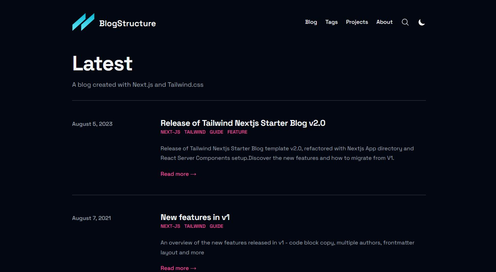

# BreweryProfile

BreweryProfile is a RESTful API built with [Next.js](https://nextjs.org/). It allows users to retrieve detailed information about breweries, including their history, background, and a range of beers they offer. This project aims to provide an easy-to-use API for accessing brewery data by name, making it ideal for beer enthusiasts, app developers, and data integrators.

<!-- 

    

 -->

## Features

- **Next.js API Routes**: Utilizes Next.js's API capabilities for creating serverless endpoints to fetch brewery data.
- **Data Retrieval**: Fetches a brewery's summary, history, and beer range based on the brewery's name.
- **Scalable and Performant**: Designed for performance with server-side rendering (SSR) and static site generation (SSG).
- **Flexible Querying**: Allows users to search for breweries using a simple and intuitive query structure.
- **SEO-Friendly**: Built with SEO in mind to ensure optimal search engine visibility for the API documentation.

## License

**All rights reserved**. This project and its content, including but not limited to code, documentation, and assets, are the exclusive property of the author. Unauthorized copying, modification, distribution, or use of any part of this project is strictly prohibited without prior written permission from the author.

For inquiries regarding usage, please contact [contact@netablue.fr]."# next-yoga-planner" 
"# next-yoga-planner" 
